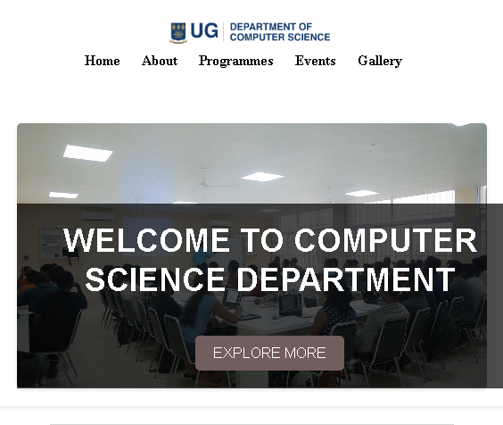
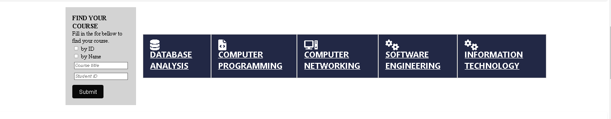
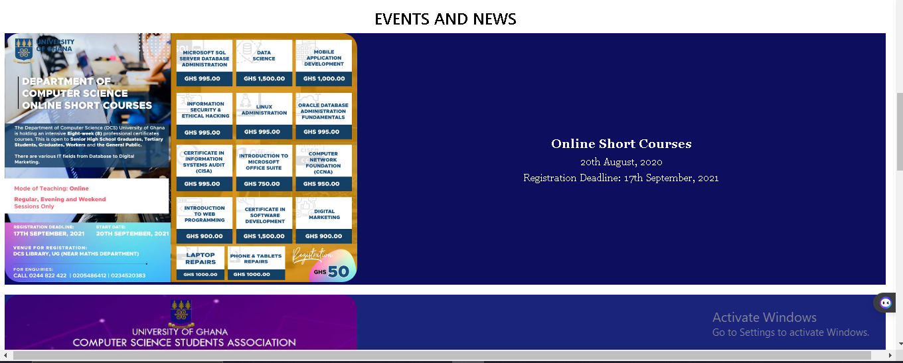
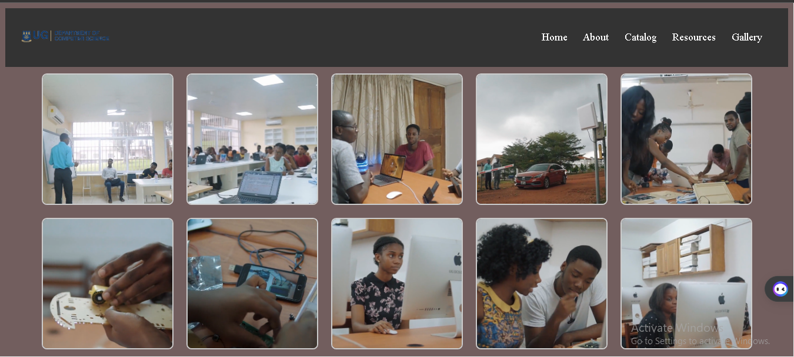
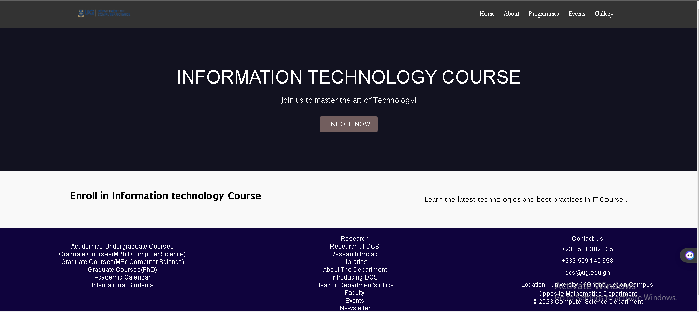
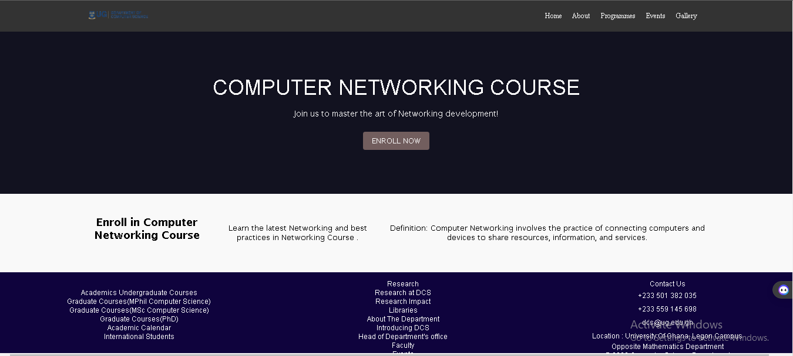
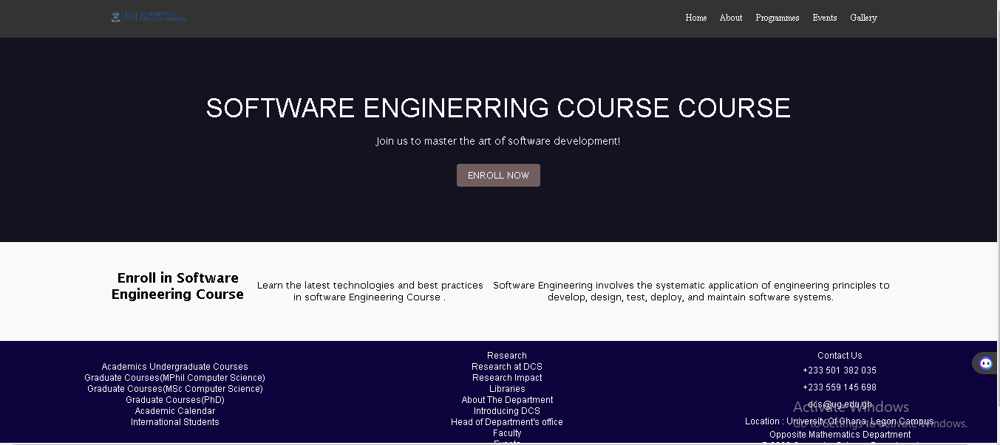

# DCIT_205_IA   


# INTRODUCTION

Welcome to the Department of Computer Science at the University of Ghana (College Of Basic and Applied Sciences)! Our department is committed to fostering a dynamic learning environment where students explore the exciting realms of computer science and technology. We aim to provide a comprehensive education that equips students with the knowledge, skills, and creativity needed to thrive in the ever-evolving field of computing.

Purpose of the Website:

Our website serves as a central hub for students, faculty, alumni, and anyone passionate about computer science. Here, you'll find:

1.Program Information: Details about our academic programs, including undergraduate and graduate degrees, courses offered, and curriculum outlines.

2.Gallery: Gallery available to students. It also includes pictures of the Department and the serene environment.

3.News and Events: Updates on departmental events, seminars, workshops, and conferences to keep everyone informed and engaged.

4.Facilities and Laboratories: Information about our state-of-the-art facilities, computer labs, and technology resources accessible to students.

5.Contact Information: How to reach us, including departmental contact details, office hours, and location on campus


 # Cloning the Project

1. Install Git:*If you haven't already, download and install Git on your computer from the official [Git website](https://git-scm.com/).

2. Open Terminal/Command Prompt:
   - For Windows: Open Command Prompt or PowerShell.
   - For macOS/Linux: Open Terminal.

3. Navigate to Desired Directory:
   Use the `cd` command to navigate to the directory where you want to clone the project. For example:
   ```
   cd path/to/desired/directory
   ```

4. Clone the Repository:   Use the `git clone` command followed by the repository URL. Replace `repository-url` with the actual URL of the repository.
   ```
   git clone repository-url
   ```
   For example:
   ```
   git clone https://github.com/username/repository-name.git
   ```

5.Authenticate (if required):
   If the repository is private and requires authentication, Git may prompt you to enter your username and password.

    Setting Up the Project:

6. Navigate into the Project Directory:
   Use the `cd` command to enter the cloned project directory:
   ```
   cd repository-name
   ```

7. Install Dependencies (if needed):
   If the project requires certain dependencies or libraries, there might be a file named `package.json` (for Node.js projects) or `requirements.txt` (for Python projects) listing these dependencies. Use the appropriate package manager (e.g., npm, yarn, pip) to install them.
   ```
   npm install   // For Node.js projects
   ```

8. Setup Environment (if applicable):
   Some projects might require environment setup, such as configuring environment variables, setting up databases, or running initial scripts. Refer to project-specific documentation or README files for any setup instructions.

9. Run the Project:
   Execute the command to start/run the project. This could vary based on the project type .


    **NAME: FENTENG KWAME MICHAEL**
    **INDEX NUMBER: 11210750**

4 **SCREENSHOT OF MY WEBSITEPAES!**
    
    
    
    
    
    
    
    
    
    


# lessons Learnt so far
    1. Improvement of skills in web development
    2. Helped me explored more features on web development
    3. Encourage to learn more in web development


**Thank you**